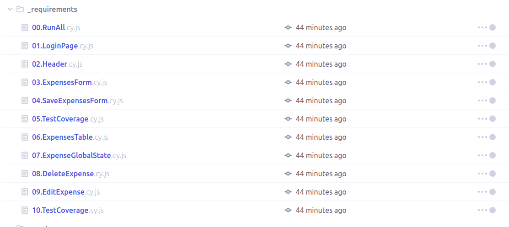
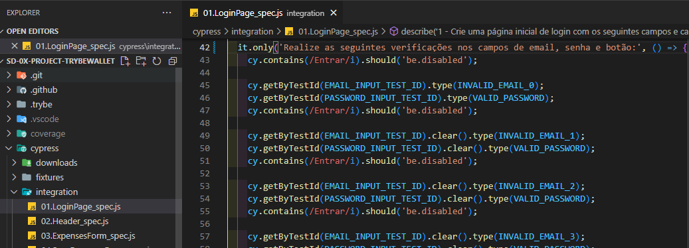
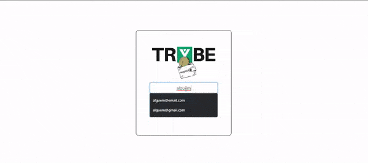
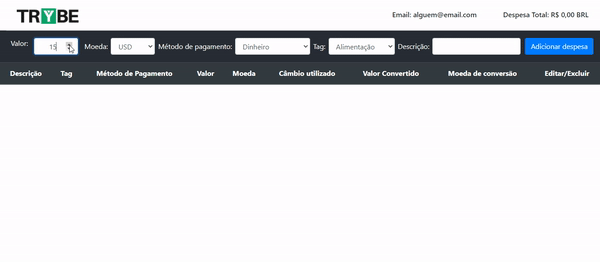
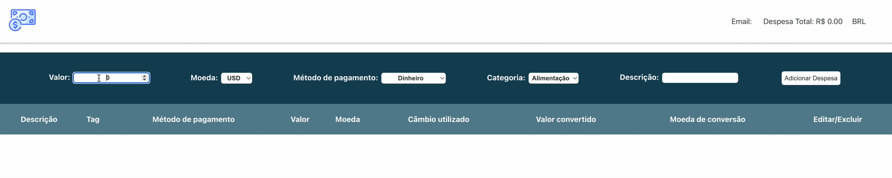
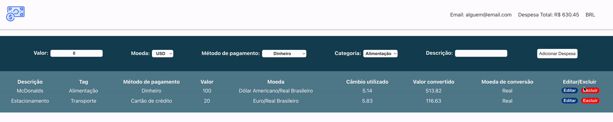
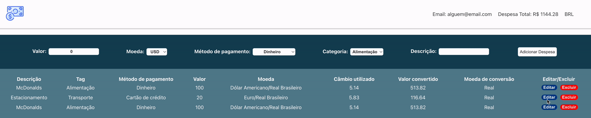
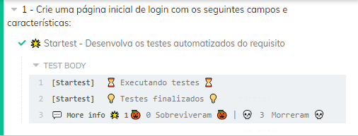
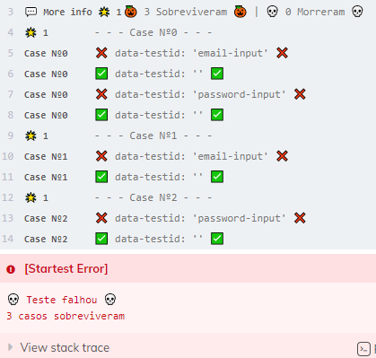
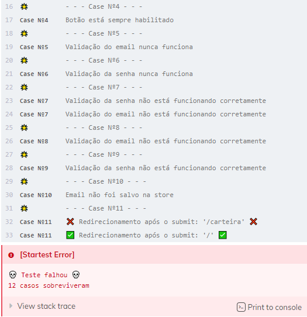

# Boas-vindas ao repositório do projeto Trybewallet!

Projeto de avaliação feito durante o curso da Trybe.

<details>
  <summary><strong>👨‍💻 O que deverá ser desenvolvido</strong></summary><br />

  Neste projeto você vai desenvolver uma carteira de controle de gastos com conversor de moedas, ao utilizar essa aplicação um usuário deverá ser capaz de:

  - Adicionar, remover e editar um gasto;
  - Visualizar uma tabelas com seus gastos;
  - Visualizar o total de gastos convertidos para uma moeda de escolha;
</details>

<details>
  <summary><strong>:memo: Habilidades</strong></summary><br />

Neste projeto, verificamos se você é capaz de:

- Criar um _store_ Redux em aplicações React

- Criar _reducers_ no Redux em aplicações React

- Criar _actions_ no Redux em aplicações React

- Criar _dispatchers_ no Redux em aplicações React

- Conectar Redux aos componentes React

- Criar _actions_ assíncronas na sua aplicação React que faz uso de Redux.
</details>

# Orientações

<details>
  <summary><strong>:memo: Para acessar o projeto</strong></summary><br />
  1. Clone o repositório: `git clone git@github.com:priscilaSartori/project-trybewallet.git`

  2. Entre na pasta do repositório que você acabou de clonar: `cd project-starwars-planets-search`

  3. Instale as dependências - `npm install`.
  
  4. Inicie a aplicação - `npm start`.
</details>

<details>
  <summary><strong>🎛 Linter</strong></summary><br />

  Para garantir a qualidade do código, vamos utilizar neste projeto o linter ESLint. Assim, o código estará alinhado com as boas práticas de desenvolvimento, sendo mais legível e de fácil manutenção! Para rodar o _linter_ localmente no projeto, execute o comando abaixo:

  `npm run lint`

</details>

<a name="testes"></a>

<details>
  <summary><strong>🛠 Testes</strong></summary><br />

* <details><summary><b> Execução de testes de requisito</b></summary>

  Os testes deste projeto foram feitos utilizando o [Cypress](https://www.cypress.io/how-it-works/). É utilizada nos testes a resolução `1366 x 768` (1366 pixels de largura por 768 pixels de altura) para testes de layout. Logo, recomenda-se desenvolver seu projeto usando a mesma resolução, via instalação [deste plugin](https://chrome.google.com/webstore/detail/window-resizer/kkelicaakdanhinjdeammmilcgefonfh?hl=en) do `Chrome` para facilitar a configuração dessa resolução, por exemplo.

  Para o projeto ser validado, todos os testes de comportamento devem passar. É possível testar isso local rodando `npm run cy`. Esse comando roda a suite de testes do Cypress que valida se o fluxo geral e os requisitos funcionais estão funcionando como deveriam. Você pode também executar o comando `npm run cy:open` para ter um resultado visual dos testes executados.

  Esses testes não consideram o layout de maneira geral, mas sim os atributos e informações corretas, então preste atenção nisso! Os testes te darão uma mensagem de erro caso não estejam passando (seja qual for o motivo). 😉

  **Atenção:** Sua aplicação deve estar rodando para o Cypress no terminal poder testar.
  </details>

* <details><summary><b> Execução de um teste específico</b></summary>

  Para executar somente uma `spec` de testes, você pode ou rodar somente um arquivo de teste com o comando `npm run cy -- --spec cypress/integration/nomeDoArquivo_spec.js`, ou também pode selecionar qual delas você deseja após executar o comando `npm run cy:open`.

  

  Além disso ainda é possível rodar apenas um trecho de um `spec`, basta utilizar a função .only após o `describe`, `it` ou `test`. Com isso, será possível que apenas parte de um teste rode localmente e seja avaliado.

  

  </details>

* <details><summary><b> Execução de teste de cobertura</b></summary>

  Alguns requisitos irão pedir para que você desenvolva testes para sua aplicação. Esses testes serão avaliados através da cobertura de testes.

  É possível verificar o percentual da cobertura de testes com o comando `npm run test-coverage`. 

  Você também pode executar `npm run test-coverage -- --collectCoverageFrom=caminho/da/Pagina` para verificar o percentual de cobertura de testes de cada 'Pagina'. Por exemplo, para verificar a cobertura de testes da página de `Login`, execute o comando `npm run test-coverage -- --collectCoverageFrom=src/pages/Login.js`.
  </details><br />
</details>

<details>
  <summary><strong id="como-desenvolver">:convenience_store: Desenvolvimento </strong></summary><br />

  Neste projeto você vai desenvolver uma carteira de controle de gastos com conversor de moedas, utilizando Redux React. Na implementação você deverá **obrigatoriamente** utilizar o seguinte formato do estado global:

```
  {
    user: {
      email: '', // string que armazena o email da pessoa usuária
    },
    wallet: {
      currencies: [], // array de string
      expenses: [], // array de objetos, com cada objeto tendo as chaves id, value, currency, method, tag, description e exchangeRates
      editor: false, // valor booleano que indica de uma despesa está sendo editada
      idToEdit: 0, // valor numérico que armazena o id da despesa que esta sendo editada
    }
  }
```

  É importante respeitar esse formato para que o avaliador funcione corretamente. Você pode adicionar novos campos ao seu estado global, mas essa estrutura básica deve se manter. Por exemplo, você pode adicionar uma propriedade `isFetching` no seu estado. Mas você **não** pode salvar as despesas em uma chave diferente de `wallet.expenses`.

  Para que os testes consigam acessar a `store` do redux e realizar os testes, é necessário adicionar o seguinte bloco de código ao arquivo da `store`:

  ```javascript
  if (window.Cypress) {
    window.store = store;
  }
  ```

  **Observações Importantes:**

  - Devido a estrutura que o avaliador utiliza para realizar os testes, é necessário que o seu Redux esteja configurado, ou seja, a store e os reducers estejam criados e conectados.

  <br />
  <details><summary><b> :bulb: Configurando o Redux DevTools</b></summary>

  Para usarmos o Redux DevTools com o Redux-Thunk, vamos utilizar uma biblioteca chamada `redux-devtools-extension` que possui a função `composeWithDevTools`. Ela já está no package.json, a única coisa que você vai precisar fazer é configurar a sua store, por exemplo:

  ```javascript
  import { applyMiddleware, legacy_createStore as createStore } from 'redux';
  import { composeWithDevTools } from '@redux-devtools/extension';
  import thunk from 'redux-thunk';
  import reducer from '../reducers';

  const store = createStore(
    reducer,
    composeWithDevTools(
      applyMiddleware(thunk),
    ),
  );

  export default store;
  ```
  </details>

  <details><summary><b> :bulb: Documentação da API de Cotações de Moedas</b></summary>

  Sua página _web_ irá consumir os dados da API do _awesomeapi API de Cotações_ para realizar a busca de câmbio de moedas. Para realizar essas buscas, vocês precisarão consultar o seguinte _endpoint_:

  - <https://economia.awesomeapi.com.br/json/all>

  O retorno desse endpoint será algo no formato:

  ```json
  {
    {
      "USD": {
        "code":"USD",
        "codein":"BRL",
        "name":"Dólar Americano/Real Brasileiro",
        "high":"5.6689",
        "low":"5.6071",
        "varBid":"-0.0166",
        "pctChange":"-0.29",
        "bid":"5.6173",
        "ask":"5.6183",
        "timestamp":"1601476370",
        "create_date":"2020-09-30 11:32:53"
        },
        ...
    }
  }
  ```

  Se você quiser aprender mais informações sobre a API, veja a [documentação](https://docs.awesomeapi.com.br/api-de-moedas).
  </details><br />

</details>

<details>
  <summary><strong>💻 Protótipo do projeto no Figma</strong></summary><br />

  Além da qualidade do código e do atendimento aos requisitos, um bom layout é um dos aspectos responsáveis por melhorar a usabilidade de uma aplicação e turbinar seu portfólio!

  Você pode estar se perguntando: *"Como deixo meu projeto com um layout mais atrativo?"* 🤔

  Para isso, disponibilizamos esse [protótipo do Figma](https://www.figma.com/file/ibAEAbS7A6EBprCvXJNhbt/%5BProjeto%5D%5BFrontend%5D-TrybeWallet?node-id=0%3A1) para lhe ajudar !

  ⚠️ A estilização de sua aplicação não será avaliada nesse projeto, portanto esse protótipo é apenas uma **sugestão** e seu uso é **opcional**. Sinta-se à vontade para modificar o layout e deixá-lo do seu jeito.

</details>

# Requisitos

## Página de Login

Crie uma página para que a pessoa usuária se identifique, com email e senha. Esta página deve ser a página inicial de seu aplicativo.

<details><summary> Página de Login</summary>

  
</details><br />

## 1. Crie uma página inicial de login com os seguintes campos e características

* A rota para esta página deve ser `/`;

* <details><summary> Você deve criar um local para que a pessoa usuária insira seu e-mail e senha:</summary>

  - O campo para o e-mail precisa ter o atributo `data-testid="email-input"`;
  - O email precisa estar em um formato válido, como 'alguem@alguem.com';
  - O campo para a senha precisa ter o atributo `data-testid="password-input"`;
  - A senha precisa possuir 6 ou mais caracteres.
</details>

* <details><summary> Crie um botão com o texto <code>Entrar</code>:</summary>

  - O botão precisa estar **desabilitado** caso o e-mail não tenha um formato válido ou a senha possua um tamanho menor que 6 caracteres;

  - Salve o email no estado global da aplicação, com a chave **_email_**, assim que a pessoa usuária _logar_;

  - A rota deve ser mudada para `/carteira` após o clique no botão '**Entrar**'.
</details>

<br />
<details><summary><strong>O que será verificado</strong></summary><br />

- A rota para esta página é `"/"`
- É renderizado um elemento para que o usuário insira seu email e senha
- É renderizado um botão com o texto `"Entrar"`
- <details><summary> Foram realizadas as seguintes verificações nos campos de email, senha e botão:</summary>

  - É um e-mail no formato válido;
  - A senha tem 6 ou mais caracteres;
  - Desabilita o botão `Entrar` caso e-mail e/ou senha estiverem no formato inválido
  - Habilita o botão `Entrar` caso e-mail e senha sejam válidos
  </details><br />
- Salva o email no estado da aplicação, com a chave email, assim que o usuário logar
- A rota é alterada para `"/carteira"` após o clique no botão
</details>

---

## Página da Carteira

Crie uma página para gerenciar a carteira de gastos em diversas moedas e que traga a despesa total em real que é representado pelo código 'BRL'. Esta página deve ser renderizada por um componente chamado **_Wallet_**.

- A rota para esta página deve ser `/carteira`;

<details><summary> Página da carteira:</summary>
  
  
</details><br />

---

## Header

## 2. Crie um header para a página de carteira contendo as seguintes características

  - O componente `Header` deve ser renderizado dentro do componente [`Wallet`](#página-da-carteira);

* <details><summary> Um elemento que exiba o e-mail da pessoa usuária que fez login:</summary>

  - Adicione o atributo `data-testid="email-field"`.

  - :bulb: **Dica**: você deve pegar o e-mail do estado global da aplicação (no Redux).
</details>

* <details><summary> Um elemento com a despesa total gerada pela lista de gastos:</summary>

  - Adicione o atributo `data-testid="total-field"` neste elemento;

  - Inicialmente esse elemento deve exibir o valor `0`;
</details>

* <details><summary> Um elemento que mostre qual câmbio está sendo utilizado, que neste caso será 'BRL':</summary>

  - Adicione o atributo `data-testid="header-currency-field"` neste elemento
</details><br />

<details>
  <summary><strong>O que será verificado</strong></summary>

- O elemento com o `data-testid="email-field"` renderiza o email salvo no estado global.
- O elemento com o `data-testid="total-field"` inicialmente renderiza o valor `0`.
- O elemento com o `data-testid="header-currency-field` renderiza o texto `BRL`.
</details>

---

## 3. Desenvolva um formulário para adicionar uma despesa contendo as seguintes características:

* O componente `WalletForm` deve ser renderizado dentro do componente [`Wallet`](#página-da-carteira);

* <details><summary> Um campo para adicionar valor da despesa:</summary>

  - Adicione o atributo `data-testid="value-input"`.
</details>

* <details><summary> Um campo para adicionar a descrição da despesa:</summary>

  - Adicione o atributo `data-testid="description-input"`.
</details>

* <details><summary> Um campo para selecionar em qual moeda será registrada a despesa.</summary>

  - O campo deve ser um `<select>`.
  - Adicione o atributo `data-testid="currency-input"`.
  - As options devem ser preenchidas pelo valor da chave `currencies` do estado global.
    - Os valores da chave <code>currencies</code> no estado global devem ser puxados através de uma requisição à API no endpoint `https://economia.awesomeapi.com.br/json/all`;
    - Remova, das informações trazidas pela API, a opção 'USDT';
    - A chave `currencies` do estado global deve ser um array.

</details>

* <details><summary> Um campo para adicionar qual método de pagamento será utilizado.</summary>

  - Este campo deve ser um `<select>`.
  - Adicione o atributo `data-testid="method-input"`.
  - A pessoa usuária deve poder escolher entre os campos: 'Dinheiro', 'Cartão de crédito' e 'Cartão de débito'.
</details>

* <details><summary> Um campo para selecionar uma categoria (tag) para a despesa.</summary>

  - O campo deve ser um `<select>`.
  - Adicione o atributo `data-testid="tag-input"`.
  - Este campo deve ser um dropdown. a pessoa usuária deve poder escolher entre os campos: 'Alimentação', 'Lazer', 'Trabalho', 'Transporte' e 'Saúde'.

</details>

<details>
  <summary><strong>Observações Importantes:</strong></summary><br />

  Note que os campos `<select>` já iniciam com um valor selecionado no seu navegador. Você também pode verificar por meio do `React Developer Tools` que o estado do seu componente inicializa sincronizado com o que é exibido no navegador.

  Para ilustrar, imagine que o estado inicial seja uma string vazia. Neste caso a pessoa usuária poderá facilmente causar um problema onde ele acredita que a opção já está selecionada (uma vez que o select mostra um valor), quando na verdade ela ainda não está (o estado foi inicalizado com uma string vazia). Por esse motivo é importante sincronizar o mesmo valor inicial do `<select>` em seu estado no react, ao invés de inicializar com uma string vazia.
</details>

<br />

<details><summary> Ilustração do formulário</summary>

  
</details><br />

<details>
  <summary><strong>O que será verificado</strong></summary>

  - O campo para adicionar o valor da despesa possui o `data-testid="value-input"`.
  - O campo para adicionar a descrição da despesa possui o `data-testid="description-input"`.
  - O campo para selecionar em qual moeda será registrada a despesa possui o `data-testid="currency-input"`.
    - A API é chamada com o endpoint `https://economia.awesomeapi.com.br/json/all`
    - O valor da chave `currencies` no estado global é um array que possui as siglas das moedas que vieram da API.
    - O campo para selecionar em qual moeda será registrada a despesa possui options com os valores iguais ao do array localizado na chave currencies do estado global.
  - O campo para selecionar qual método de pagamento será utilizado possui o `data-testid="method-input"`.
  - O campo para selecionar qual método de pagamento será utilizado possui options com os valores `Dinheiro`, `Cartão de crédito` e `Cartão de débito`.
  - O campo para selecionar uma categoria (tag) da despesa possui o `data-testid="tag-input"`
  - O campo para selecionar uma categoria (tag) da despesa possui options com os valores `Alimentação`, `Lazer`, `Trabalho`, `Transporte` e `Saúde`.
</details>

---

## 4. Salve todas as informações do formulário no estado global

* Crie um botão com o texto \'Adicionar despesa\'. Ele servirá para salvar as informações da despesa no estado global e atualizar a soma de despesas no header.

* <details><summary> Desenvolva a funcionalidade do botão "Adicionar despesa" de modo que, ao clicar no botão, as seguintes ações sejam executadas:</summary>

  - <details><summary> Os valores dos campos devem ser salvos no estado da aplicação, na chave <b><i>expenses</i></b>, dentro de um array contendo todos gastos que serão adicionados:</summary>

    - O `id` da despesa **deve** ser um número sequencial, começando em 0. Ou seja: a primeira despesa terá id 0, a segunda terá id 1, a terceira id 2, e assim por diante.
    - :bulb: **Atenção nesse ponto**: você deverá fazer uma requisição para a API e buscar a cotação no momento que o botão de `Adicionar despesa` for apertado. Para isso você poderá utilizar um thunk.
      - **Você deverá salvar a cotação do câmbio feita no momento da adição** que será necessária para efetuar a edição do gasto (requisito 8). Caso você não tenha essa informação salva, o valor da cotação trazida poderá ser diferente do obtido anteriormente.

    </details>

  - <details><summary> Após adicionar a despesa:</summary>

    - Atualize a soma total das despesas (utilize a chave `ask` para realizar essa soma). Essa informação deve ficar no [`header`](#2-crie-uma-página-para-sua-carteira-com-as-seguintes-características) dentro do elemento com `data-testid="total-field"`;
      - O elemento com o testid deve conter apenas a soma total das despesas.
      - O valor total deverá ser exibido com 2 casas decimais. Exemplo: (valor - ponto - duas casas decimais) `100.00` `23.50`

    - Limpe os inputs de valor e descrição.
    </details>

  - <details><summary> As despesas salvas no Redux ficarão com um formato semelhante ao seguinte:</summary>

      ```javascript
      expenses: [{
        "id": 0,
        "value": "3",
        "description": "Hot Dog",
        "currency": "USD",
        "method": "Dinheiro",
        "tag": "Alimentação",
        "exchangeRates": {
          "USD": {
            "code": "USD",
            "name": "Dólar Comercial",
            "ask": "5.6208",
            ...
          },
          "CAD": {
            "code": "CAD",
            "name": "Dólar Canadense",
            "ask": "4.2313",
            ...
          },
          "EUR": {
            "code": "EUR",
            "name": "Euro",
            "ask": "6.6112",
            ...
          },
          "GBP": {
            "code": "GBP",
            "name": "Libra Esterlina",
            "ask": "7.2498",
            ...
          },
          "ARS": {
            "code": "ARS",
            "name": "Peso Argentino",
            "ask": "0.0729",
            ...
          },
          "BTC": {
            "code": "BTC",
            "name": "Bitcoin",
            "ask": "60299",
            ...
          },
          "LTC": {
            "code": "LTC",
            "name": "Litecoin",
            "ask": "261.69",
            ...
          },
          "JPY": {
            "code": "JPY",
            "name": "Iene Japonês",
            "ask": "0.05301",
            ...
          },
          "CHF": {
            "code": "CHF",
            "name": "Franco Suíço",
            "ask": "6.1297",
            ...
          },
          "AUD": {
            "code": "AUD",
            "name": "Dólar Australiano",
            "ask": "4.0124",
            ...
          },
          "CNY": {
            "code": "CNY",
            "name": "Yuan Chinês",
            "ask": "0.8278",
            ...
          },
          "ILS": {
            "code": "ILS",
            "name": "Novo Shekel Israelense",
            "ask": "1.6514",
            ...
          },
          "ETH": {
            "code": "ETH",
            "name": "Ethereum",
            "ask": "5184",
            ...
          },
          "XRP": {
            "code": "XRP",
            "name": "Ripple",
            "ask": "1.4",
            ...
          }
        }
      }]
      ```
    </details>
</details><br />
<details>
  <summary><strong>O que será verificado</strong></summary>

  - É renderizado um botão com o texto "Adicionar despesa".
  - Ao clicar no botão "Adicionar despesa"
    - é feita uma requisição a API
    - é salva uma nova despesa na chave `expenses` do estado global
    - o valor total do elemento com o `data-testid="total-field"` é atualizado.
    - cada despesa possui um id sequencial.
    - os inputs de valor e descrição voltam ao valor inicial, contendo o valor `""`
    - é exibido o total das despesas com 2 casas decimais no elemento com o `data-testid="total-field"`, levando em consideração a cotação localizada na chave `ask`.
</details>

---

## 5. Desenvolva testes para atingir 60% de cobertura total da aplicação

<details>
<summary><strong>Observações técnicas</strong></summary><br />

  * Os testes criados por você não irão influenciar os outros requisitos no avaliador. Você deverá desenvolver seus testes unitários/integração usando a biblioteca React Testing Library, enquanto o avaliador usará a biblioteca [Cypress](https://docs.cypress.io/) para avaliar os requisitos, inclusive os de cobertura.
  * Em caso de dúvidas leia a seção <a href="#testes">Testes > Execução de teste de cobertura</a>.

</details>

<details>
<summary><strong>O que será avaliado</strong></summary><br />

  * Será validado se ao executar `npm run test-coverage` são obtidos os seguintes resultados:
    * `% Stmts` da linha `All files` é maior ou igual a 60.
    * `% Branch` da linha `All files` é maior ou igual a 60.
    * `% Funcs` da linha `All files` é maior ou igual a 60.
    * `% Lines` da linha `All files` é maior ou igual a 60.
</details>

---

## Tabela de Gastos

## 6. Desenvolva uma tabela com os gastos contendo as seguintes características:

  - O componente `Table` deve ser renderizado dentro do componente [`Wallet`](#página-da-carteira);

* <details><summary> A tabela deve possuir um cabeçalho com os seguintes valores:</summary>

    - Descrição;
    - Tag;
    - Método de pagamento;
    - Valor;
    - Moeda;
    - Câmbio utilizado;
    - Valor convertido;
    - Moeda de conversão;
    - Editar/Excluir.
</details><br />

<details>
  <summary><strong>O que será verificado</strong></summary>

- A tabela possui um cabeçalho com elementos `<th>` com os valores `Descrição`, `Tag`, `Método de pagamento`,`Valor`, `Moeda`, `Câmbio utilizado`, `Valor convertido`, `Moeda de conversão` e `Editar/Excluir`.
</details>

---

## 7. Implemente a lógica para que a tabela seja alimentada pelo estado da aplicação

* <details><summary> A tabela deve ser alimentada pelo estado da aplicação, que estará disponível na chave <b><i>expenses</i></b> que vem do <i>reducer</i> <code>wallet</code>:</summary>

  - O campo de `Moeda` deverá conter o nome da moeda. Portanto, ao invés de 'USD' ou 'EUR', deve conter "Dólar Americano/Real Brasileiro" e "Euro/Real Brasileiro", respectivamente;

  - O elemento que exibe a `Moeda de conversão` deverá ser sempre 'Real';

  - Atenção também às casas decimais dos campos. Como são valores contábeis, eles devem apresentar duas casas após o ponto. Arredonde sua resposta somente na hora de renderizar o resultado e, para os cálculos, utilize sempre os valores vindos da API (utilize o campo `ask` que vem da API).

  - Utilize sempre o formato `0.00` (número - ponto - duas casas decimais).
</details><br />

<details>
  <summary><strong>O que será verificado</strong></summary>

  - A tabela é atualizada com as informações vindas da chave `expense` do estado global.
  - A tabela possui um corpo com um elemento `<tr>` para cada despesa.
  - O elemento `<tr>` possui elementos `<td>` com `Descrição`, `Tag`, `Método de pagamento`,`Valor`, `Moeda`, `Câmbio utilizado`, `Valor convertido`, `Moeda de conversão` de cada despesa.
</details>

---

## 8. Crie um botão para deletar uma despesa da tabela contendo as seguintes características:

<details><summary> Ilustração do botão</summary>

  
</details>

* O botão deve ser o último item da linha da tabela e deve possuir o atributo `data-testid="delete-btn"`.

* Após o botão ser clicado, a seguintes ações deverão ocorrer:
  * A despesa deverá ser deletada do estado global
  * A despesa deixará de ser exibida na tabela
  * O valor total exibido no header será alterado.

<br /><details>
  <summary><strong>O que será verificado</strong></summary>

- O botão se encontra no último elemento `<td>` de cada elemento `<tr>`.
- O botão possui o `data-testid="delete-btn"`.
- Ao clicar no botão, a despesa é removida do estado global e consequentemente da tabela.
- Ao clicar no botão, a despesa total é atualizada no header, subtraindo o valor correspondente.
</details>

---

## 9. Crie um botão para editar uma despesa da tabela contendo as seguintes características:


<details><summary> Ilustração do botão</summary>

  
</details>

* O botão deve estar dentro do último item da linha da tabela e deve possuir `data-testid="edit-btn"`

* <details><summary> Ao ser clicado, o botão habilita um formulário para editar a linha da tabela. Ao clicar em "Editar despesa" ela é atualizada, alterando o estado global.</summary>

  - O formulário deverá ter os mesmos `data-testid` do formulário de adicionar despesa. Você pode reaproveitá-lo.

  - O botão para submeter a despesa para edição deverá conter **exatamente** o texto "Editar despesa"

  - Após a edição da despesa, a ordem das despesas na tabela precisa ser mantida.

  - :bulb: **Obs**: para esse requisito, não é necessário popular os inputs com os valores prévios da despesa. A imagem do gif é apenas uma sugestão. 

  - :bulb: Lembre-se de utilizar o formato do estado global da aplicação informado na seção <a href="#como-desenvolver">Desenvolvimento</a>

  - **Atenção**: o câmbio utilizado na edição deve ser o mesmo do cálculo feito na adição do gasto.
</details><br />

<details>
  <summary><strong>O que será verificado</strong></summary>

- O botão se encontra no último elemento `<td>` de cada elemento `<tr>`.
- O botão possui o `data-testid="edit-btn"`.
- Ao ser clicado, o formulário de adição passa a ser um formulário de edição.
- Ao ser clicado, o botão com o texto `"Adicionar Despesa"` é alterado para `"Editar despesa"`.
- Após editar uma despesa a chave `expenses` no estado global é atualizada com o novo valor.
- A ordem das despesas é mantida após a edição.
- O valor no campo com o `data-testid="total-field"` é atualizado após a edição de uma despesa.
</details>

## 10. Desenvolva testes para atingir 90% de cobertura total da aplicação

<details>
<summary><strong>Observações técnicas</strong></summary><br />

  * Os testes criados por você não irão influenciar os outros requisitos no avaliador. Você deverá desenvolver seus testes unitários/integração usando a biblioteca React Testing Library, enquanto o avaliador usará a biblioteca [Cypress](https://docs.cypress.io/) para avaliar os requisitos, inclusive os de cobertura.
  * Em caso de dúvidas leia a seção <a href="#testes">Testes > Execução de teste de cobertura</a>.

</details>

<details>
<summary><strong>O que será avaliado</strong></summary><br />

  * Será validado se ao executar `npm run test-coverage` são obtidos os seguintes resultados:
    * `% Stmts` da linha `All files` é maior ou igual a 90.
    * `% Branch` da linha `All files` é maior ou igual a 90.
    * `% Funcs` da linha `All files` é maior ou igual a 90.
    * `% Lines` da linha `All files` é maior ou igual a 90.
</details>


# Requisitos Secretos Startest (não avaliativos)

Os requisitos abaixo não serão avaliados pelo avaliador, porém você poderá executa-los, todos eles se encontram na pasta `cypress/integration/secrets`.

## 🌟 Requisitos Startest

* <details><summary>Como desenvolver e o que é Startest</summary><br />

  
  Esse projeto conta com requisitos especiais chamados de requisitos `Startest`, para concluir um requisito Startest, além de desenvolver o que é pedido no requisito você também deverá desenvolver testes automatizados utilizando a biblioteca [React Testing Library](https://testing-library.com/docs/react-testing-library/intro) que deverão verificar os mesmos pontos pedidos no requisito. 
  
  Para auxiliar no desenvolvimento dos seus testes a pasta `tests/helpers`, consta com ferramentas como `mockData`, `renderWithRouter` e `renderWithRouterAndRedux`.

  Exemplo de requisito Startest:

  ```
  X. Crie uma página de login
  🌟 [Requisito Startest] 🌟
    A página deverá conter:
      - Um campo de email com o atributo data-testid="email-input"
      - Um campo de senha com o atributo data-testid="password-input"
  ```

  Nesse caso, além de desenvolver a página de login com seus respectivos elementos, você deverá desenvolver testes para também verificar esses mesmos data-testid e seus elementos. **Como pode notar essa é uma excelente oportunidade para colocar em prática o conceito de TDD!**

  Requisitos Startest irão exigir algumas configurações especificas **se atente as instruções de cada requisito!!** Exemplo:

  ```
  X. Crie uma página de login
  🌟 [Requisito Startest] 🌟
    O componente da página deverá se encontrar em "src/pages/Login" ou "src/pages/Login/index"
    O arquivo de teste deverá se chamar "X.star.test.js"
    /* ... */
  ```

  Importante ressaltar que os testes desse arquivo, deverão possuir o mesmo escopo do requisito, ou seja, você deverá testar apenas o que foi desenvolvido no requisito. Caso queira testar algo fora do escopo do requisito você deverá utilizar outro arquivo.

  Tenha em mente que haverão requisições em alguns requisitos, em todos esses requisitos é importante utilizar um mock para garantir melhor desempenho e maior confiabilidade dos seus testes.

  **O mock da requisição deverá ser feito no método `fetch` do `window`!** Além disso o mock deverá ser realizado dentro de um `beforeEach` ou dentro de cada `it`/`test`.

  O requisito Startest é executado como qualquer outro requisito de teste do cypress, mais informações na seção de <a href="#testes">Testes</a>.

* <details><summary>Como funcionam os test cases Startest</summary><br />

  O Startest funciona da seguinte maneira para cada requisito:

  Na fase inicial o seu teste é executado uma vez com o seu componente original e uma vez com um componente falso sem nenhuma modificação.
  - Esperado que todos os testes com o componente original `passem` sem problemas.
  - Esperado que todos os testes com o componente falso `passem` sem problemas, o componente falso conta apenas com o que é pedido no requisito, por tanto o teste também pode falhar caso você tente testar algo fora do escopo do requisito.

  <br/>
  Após a fase inicial o seu teste será executado apenas com o componente falso, e a cada test case esse componente falso irá ser modificado e pode se comportar de uma maneira diferente, sendo esperado que ele <code>falhe</code> em todos test cases.

  <br/>
  Seguindo então o exemplo

  ```
    X. Crie uma página de login
    🌟 [Requisito Startest] 🌟
      A página deverá conter:
        - Um campo de email com o atributo data-testid="email-input"
        - Um campo de senha com o atributo data-testid="password-input"
  ```

  O componente falso irá contar com três test cases, onde o componente falso irá exibir:
  1. Os dois inputs com seus data-testids vazios.
     - Esperado que seu teste `falhe` por falta do testId em **ambos os inputs**. 
  2. Apenas o input de **senha** com o testId vazio.
     - Esperado que seu teste `falhe` por falta do testId no **input de password**.
  3. Apenas o input de **email** com o testId vazio.
     - Esperado que seu teste `falhe` por falta do testId no **input de email**.

  <br/>
  Caso seu teste falhe em todos os casos acima, significa que você está testando corretamente tudo o que foi pedido no requisito! Logo você passará no requisito Startest e uma mensagem como essa será exibida:
  
  
  
  Caso o seu teste passe em um test case sem falhar, essa mensagem será exibida com informações de cada caso que sobreviveu te indicando o que você não testou do requisito. (O ❌ indica qual era o valor original e o ✅ indica o valor que o test case inseriu)
  
  

  >Note que em casos como o do test Case Nº0, onde o componente falso exibiu os dois inputs sem nenhum testId, as mensagens podem ser repetidas posteriormente pelos outros cases que modificam apenas um input.

  Claro que nem sempre estaremos apenas testando data-testids e no Startest não é diferente, existem cases que irão modificar o comportamento do componente falso, nesses casos você poderá ver mensagens como essas:

  

  Nesse caso a mensagem "Validação da senha não está funcionando corretamente" **NÃO quer dizer que o seu componente não está validando a senha** e sim  que você não está testando corretamente a validação da senha nos seus testes, sabendo disso e utilizando o readme, você poderá verificar como a validação é pedida no requisito para entender como você deverá testá-la.

</details>

> Requisitos numerados em relação a quais requisitos originais deverão ser testados.
> 
> Dependendo do requisito, os testes podem demorar um pouco para serem executados.

<details><summary>1. Desenvolva os testes automatizados do Login</summary>

  - Você deverá desenvolver testes que irão verificar tudo o que é pedido no [requisito 1](#1-crie-uma-página-inicial-de-login-com-os-seguintes-campos-e-características).
  - O componente deverá se encontrar em `src/pages/Login`
  - O arquivo de teste deverá se chamar `01.star.test.js`

    <details><summary><strong>🌟 O que você deverá testar</strong></summary>

    - A rota para esta página é `"/"`
    - É renderizado um elemento para que o usuário insira seu email e senha
    - É renderizado um botão com o texto `"Entrar"`
    - Foram realizadas as seguintes verificações nos campos de email, senha e botão:
      - É um e-mail no formato válido;
      - A senha tem 6 ou mais caracteres;
      - Desabilita o botão `Entrar` caso e-mail e/ou senha estiverem no formato inválido
      - Habilita o botão `Entrar` caso e-mail e senha sejam válidos
    - Salva o email no estado da aplicação, com a chave email, assim que o usuário logar
    - A rota é alterada para `"/carteira"` após o clique no botão
    </details>
    <br />
</details>


<details><summary>3. Desenvolva os testes automatizados do formulário de despesas</summary>

  - Você deverá desenvolver testes que irão verificar tudo o que é pedido no [requisito 3](#3-desenvolva-um-formulário-para-adicionar-uma-despesa-contendo-as-seguintes-características).
  - O componente deverá se encontrar em `src/components/WalletForm`
  - O arquivo de teste deverá se chamar `03.star.test.js`
  - Tenha em mente que serão feitas requisições nesse requisito, fique a vontade para utilizar os dados mockados em `test/helpers/mockData.js` ou criar seu próprio mock.

    <details>
    <summary><strong>🌟 O que você deverá testar</strong></summary>

    - O campo para adicionar o valor da despesa possui o `data-testid="value-input"`.
    - O campo para adicionar a descrição da despesa possui o `data-testid="description-input"`.
    - O campo para selecionar em qual moeda será registrada a despesa possui o `data-testid="currency-input"`.
      - A API é chamada com o endpoint `https://economia.awesomeapi.com.br/json/all`
      - O valor da chave `currencies` no estado global é um array que possui as siglas das moedas que vieram da API.
      - O campo para selecionar em qual moeda será registrada a despesa possui options com os valores iguais ao do array localizado na chave currencies do estado global.
    - O campo para selecionar qual método de pagamento será utilizado possui o `data-testid="method-input"`.
    - O campo para selecionar qual método de pagamento será utilizado possui options com os valores `Dinheiro`, `Cartão de crédito` e `Cartão de débito`.
    - O campo para selecionar uma categoria (tag) da despesa possui o `data-testid="tag-input"`
    - O campo para selecionar uma categoria (tag) da despesa possui options com os valores `Alimentação`, `Lazer`, `Trabalho`, `Transporte` e `Saúde`.
    </details>
  <br />
</details>

<details><summary>4. Desenvolva os testes automatizados do salvamento das despesas</summary>

  - Você deverá desenvolver testes que irão verificar tudo o que é pedido neste requisito.
  - O componente do formulário deverá se encontrar em `src/components/WalletForm`
  - O componente do [header](#2-crie-um-header-para-a-página-de-carteira-contendo-as-seguintes-características) deverá se encontrar em `src/components/Header`
  - O arquivo de teste deverá se chamar `04.star.test.js`
  - Tenha em mente que serão feitas requisições nesse requisito, fique a vontade para utilizar os dados mockados em `test/helpers/mockData.js` ou criar seu próprio mock.

    <details>
    <summary><strong>🌟 O que você deverá testar</strong></summary>

    - É renderizado um botão com o texto "Adicionar despesa".
    - Ao clicar no botão "Adicionar despesa"
      - é feita uma requisição a API
      - é salva uma nova despesa na chave `expenses` do estado global
      - o valor total do elemento com o `data-testid="total-field"` é atualizado.
      - cada despesa possui um id sequencial.
      - os inputs de valor e descrição voltam ao valor inicial, contendo o valor `""`
      - é exibido o total das despesas com 2 casas decimais no elemento com o `data-testid="total-field"`, levando em consideração a cotação localizada na chave `ask`.
    </details>
  <br />
</details>

<details><summary>8. Desenvolva os testes automatizados do botão que deleta as despesas</summary>

  - Você deverá desenvolver testes que irão verificar tudo o que é pedido no [requisito 8](#8-crie-um-botão-para-deletar-uma-despesa-da-tabela-contendo-as-seguintes-características).
  - O componente da [tabela](#tabela-de-gastos) deverá se encontrar em `src/components/Table`
  - O componente do [header](#2-crie-um-header-para-a-página-de-carteira-contendo-as-seguintes-características) deverá se encontrar em `src/components/Header`
  - O arquivo de teste deverá se chamar `08.star.test.js`

    <details><summary><strong>🌟 O que você deverá testar</strong></summary>

    - O botão se encontra no último elemento `<td>` de cada elemento `<tr>`.
    - O botão possui o `data-testid="delete-btn"`.
    - Ao clicar no botão, a despesa é removida do estado global e consequentemente da tabela.
    - Ao clicar no botão, a despesa total é atualizada no header, subtraindo o valor correspondente.
    </details>
  <br />
</details>
